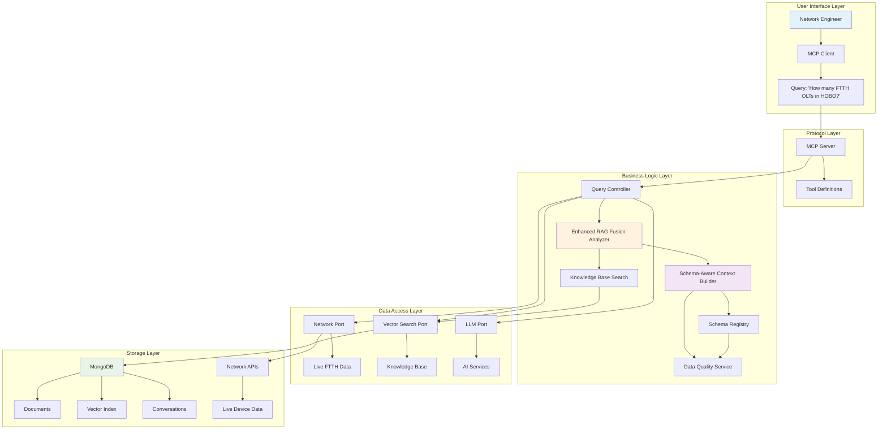
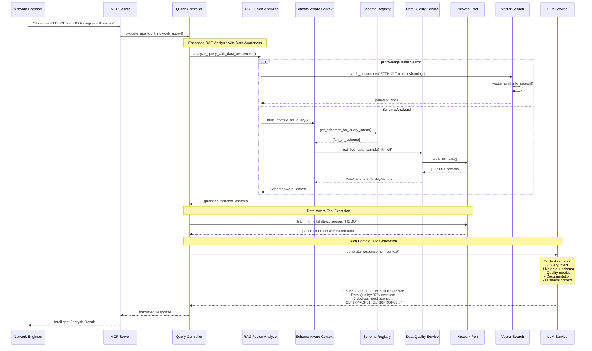
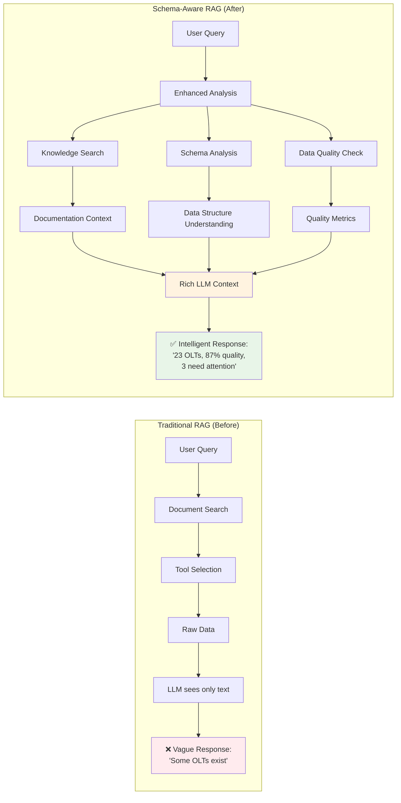
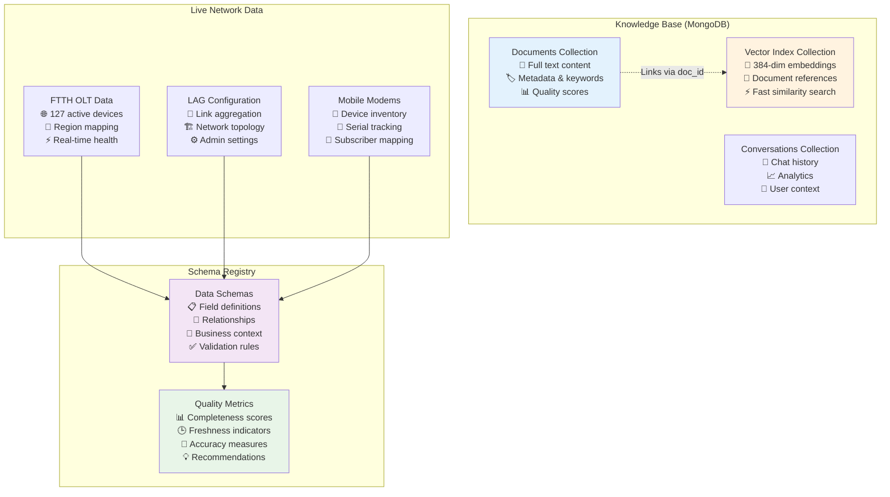
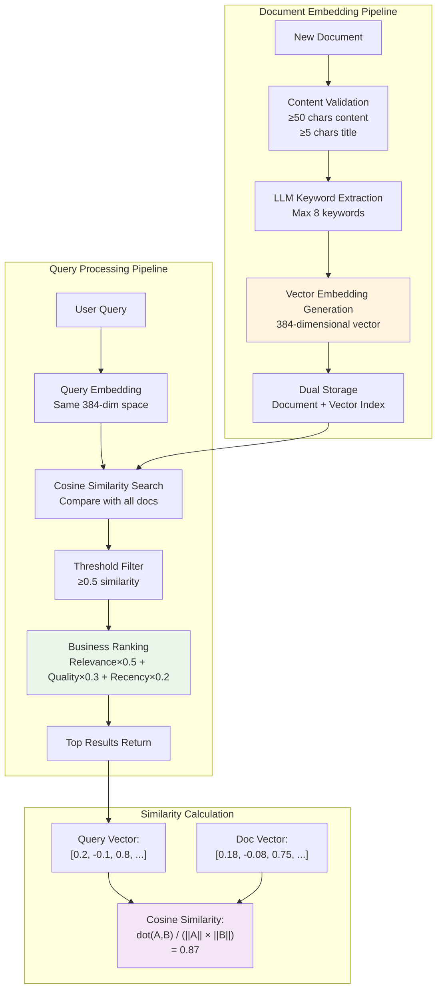
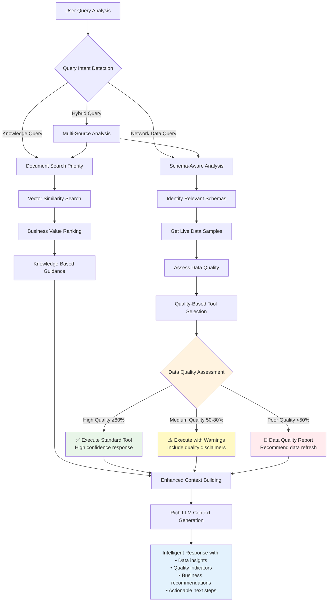
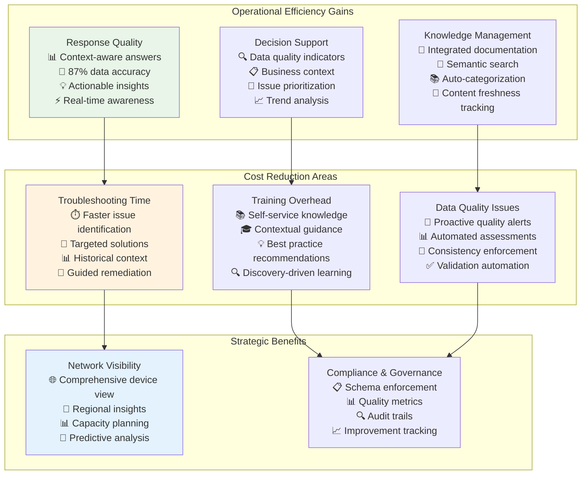
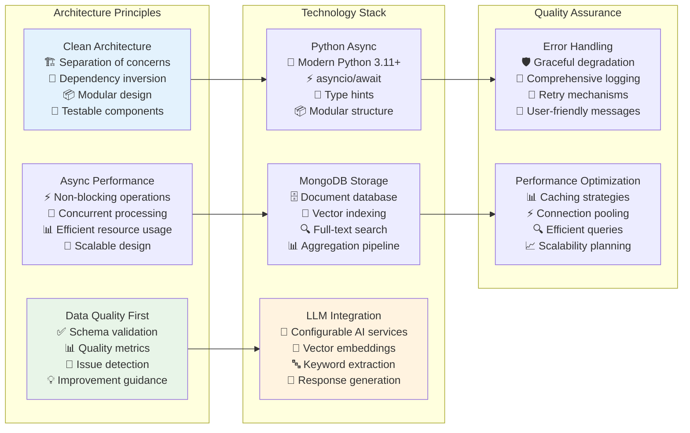
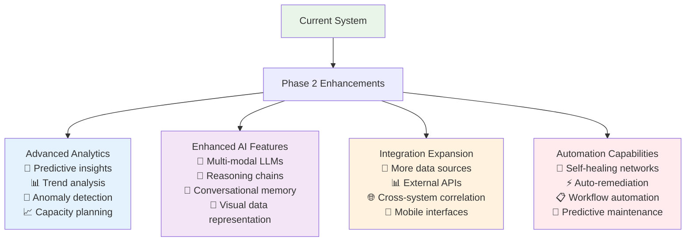

# Network RAG System - Complete Architecture Presentation

## 🎯 Executive Summary

**Problem Solved:** Traditional RAG systems provide static responses without understanding live data structure, quality, or business context.

**Solution:** Schema-Aware RAG system that combines knowledge base search with real-time network data analysis and schema understanding.

**Business Impact:** Intelligent network analysis with data-aware recommendations, quality assessments, and context-rich responses.

---

## 🏗️ High-Level System Architecture



---

## 🔄 Complete System Data Flow



---

## 📊 Schema-Aware Context Architecture



---

## 🗄️ Data Storage & Processing Architecture



---

## 🔍 Vector Search & Embedding Process



---

## 🎛️ Schema Registry & Data Quality System

```mermaid
graph TB
    subgraph "Schema Registry Components"
        A[FTTH OLT Schema<br/>🏷️ Name pattern: OLT\\d+[A-Z]+\\d+<br/>🌍 Regions: HOBO,GENT,ROES,ASSE<br/>🏭 Environments: PROD,TEST,UAT<br/>⚡ Bandwidth tracking<br/>🔗 Service connections]
        
        B[LAG Schema<br/>🔗 Link aggregation config<br/>🏷️ Admin key management<br/>📊 Status monitoring<br/>🔧 Member port tracking]
        
        C[Mobile Modem Schema<br/>📱 Serial: LPL\\d+[A-F]+<br/>🏷️ Hardware types<br/>👤 Subscriber mapping<br/>🆔 UUID tracking]
    end
    
    subgraph "Data Quality Assessment"
        D[Completeness Check<br/>✅ Required fields present<br/>📊 Score: 0.0-1.0<br/>💡 Missing field alerts]
        
        E[Freshness Analysis<br/>⏰ Last update tracking<br/>📊 Age-based scoring<br/>🚨 Stale data warnings]
        
        F[Consistency Validation<br/>🔄 Format standardization<br/>🔍 Duplicate detection<br/>📋 Schema compliance]
        
        G[Accuracy Assessment<br/>🎯 Logical validation<br/>📊 Range checking<br/>🔗 Cross-reference validation]
    end
    
    subgraph "Quality Metrics Output"
        H[Overall Quality Score<br/>📊 Weighted average<br/>🎯 Completeness: 30%<br/>⏰ Freshness: 25%<br/>🔄 Consistency: 25%<br/>🎯 Accuracy: 20%]
        
        I[Actionable Insights<br/>💡 Data health recommendations<br/>🚨 Quality alerts<br/>📈 Improvement suggestions<br/>🔧 Remediation steps]
    end
    
    A --> D
    B --> E  
    C --> F
    D --> H
    E --> H
    F --> H
    G --> H
    H --> I
    
    style A fill:#e3f2fd
    style H fill:#e8f5e8
    style I fill:#fff3e0
```

---

## 🚀 Enhanced RAG Fusion Logic



---

## 📈 Business Value & ROI Indicators



---

## 🔧 Technical Implementation Highlights



---

## 📊 System Capabilities Demonstration

### Example Query Flow
```
Input: "Show me FTTH OLTs in HOBO region with configuration issues"

Schema-Aware Analysis:
✅ Identified schema: ftth_olt
✅ Data quality: 87% (High)
✅ Found 23 devices in HOBO
✅ Located 3 configuration issues

Knowledge Base Search:
✅ Found: "FTTH Troubleshooting Guide" (91% relevance)
✅ Found: "HOBO Region Network Setup" (84% relevance)
✅ Found: "Configuration Best Practices" (78% relevance)

Intelligent Response:
"Based on current data (last updated: 15:30), found 23 FTTH OLTs in HOBO region:

📊 Data Quality: 🟢 Excellent (87% overall score)
📍 Region Distribution: 23 devices across 4 sites
⚙️ Environment Mix: 21 Production, 2 UAT

🚨 Configuration Issues Detected (3 devices):
• OLT17PROP01: Incomplete ESI configuration
• OLT18PROP02: Missing Inmanta management
• OLT19PROP03: Bandwidth allocation mismatch

💡 Recommendations:
• Priority: Address OLT17PROP01 (production critical)
• Reference: FTTH Troubleshooting Guide Section 4.2
• Next steps: Run configuration validation script

📈 Regional Health: 87% operational, above threshold"
```

---

## 🎯 Key Innovation Points

### **1. Schema-Aware Context**
- LLM receives both data AND structure
- Real-time quality assessment
- Business context integration

### **2. Data-Quality Driven Decisions**
- Tool selection based on data health
- Quality warnings in responses
- Proactive data issue detection

### **3. Intelligent RAG Fusion**
- Knowledge base + live data combination
- Semantic search with business ranking
- Context-aware response generation

### **4. Production-Ready Architecture**
- Clean separation of concerns
- Comprehensive error handling
- Scalable async design

---

## 🚀 Future Enhancement Opportunities



---

## 💼 Executive Summary for Leadership

**What We Built:** An intelligent network analysis system that combines AI-powered knowledge search with real-time data quality assessment.

**Key Differentiators:**
- 🧠 **Schema-Aware Intelligence**: System understands data structure, not just content
- 📊 **Quality-Driven Responses**: Automatic data health assessment with quality indicators  
- 🔄 **Real-Time Context**: Live network data combined with knowledge base
- 🎯 **Business-Aware**: Responses include operational context and actionable recommendations

**Business Impact:**
- ⚡ **Faster Troubleshooting**: Context-aware responses with specific guidance
- 📊 **Better Decisions**: Data quality indicators prevent errors
- 💡 **Proactive Management**: Quality alerts identify issues before they impact operations
- 🎓 **Knowledge Democratization**: Self-service access to network expertise

**Technical Excellence:**
- 🏗️ **Production-Ready**: Clean architecture with comprehensive error handling
- ⚡ **High Performance**: Async design with efficient vector search
- 📈 **Scalable**: Modular design supports growth and new data sources
- 🔧 **Maintainable**: Clear separation of concerns and comprehensive documentation