# 🧭 Network RAG System - Complete Code Walkthrough

## 🚀 System Architecture & Query Flow Journey

This document provides a comprehensive walkthrough of how a user query flows through the Network RAG System, with detailed code examples and function explanations.

---

## 📋 Table of Contents

1. [System Entry Point](#system-entry-point)
2. [Query Flow Journey](#query-flow-journey)  
3. [Core Components Deep Dive](#core-components-deep-dive)
4. [Example Query Walkthrough](#example-query-walkthrough)
5. [Function Reference](#function-reference)
6. [Architecture Patterns](#architecture-patterns)

---

## 🏗️ System Entry Point

### `main.py` - The Gateway

**Location**: `/main.py`

**Purpose**: Main system entry point that orchestrates the entire Network RAG system initialization and demo execution.

```python
async def main():
    """
    STEP 1: System Bootstrap
    - Initialize Network RAG Demo
    - Load vectorized health knowledge
    - Connect to LM Studio LLM
    - Setup MCP server patterns
    """
    
    demo = NetworkRAGDemo()
    
    # Initialize system with mock data + real LLM
    success = await demo.initialize(use_mock_data=True)
    
    if not success:
        print("❌ Failed to initialize system")
        return
    
    # Execute demo scenarios
    await demo.run_demo_scenarios()
```

**Key Responsibilities:**
- **System Bootstrap**: Initialize all adapters and controllers
- **Health Rules Loading**: Load vectorized knowledge into mock storage
- **LLM Connection**: Test and establish LM Studio connection
- **Demo Orchestration**: Run predefined query scenarios

---

## 🔄 Query Flow Journey

### The Complete Path of a Network Query

Let's trace how the query **"How many FTTH OLTs are in HOBO region?"** flows through the system:

```mermaid
flowchart TD
    A["🎯 User Query: 'How many FTTH OLTs are in HOBO region?'"] --> B[MCP Server Tool: network_query]
    B --> C[Query Controller: analyze_query]
    C --> D[RAG Fusion Analyzer: analyze_request]
    D --> E[Tool Selection: device_listing]
    E --> F[Network API Adapter: fetch_ftth_olts]
    F --> G[Knowledge Health Analyzer: apply_health_rules]
    G --> H[Vector Search: find_relevant_health_rules]
    H --> I[LM Studio LLM: generate_intelligent_response]
    I --> J["📋 Formatted Response with Health Analysis"]
    
    style A fill:#e1f5fe
    style J fill:#e8f5e8
    style H fill:#fce4ec
```



---

## 🧠 Core Components Deep Dive

### 1. MCP Server Entry Point

**File**: `src/network_rag/inbound/mcp_server_standard.py`

```python
@mcp.tool()
async def network_query(
    query: str,
    include_recommendations: bool = True
) -> str:
    """
    🎯 ENTRY POINT: All queries start here
    
    This is the main tool exposed via MCP (Model Context Protocol)
    that accepts natural language queries and returns intelligent responses.
    """
    
    if not query_controller:
        return "❌ System not initialized. Query controller unavailable."
    
    try:
        # STEP 1: Analyze the user query
        response = await query_controller.process_query(
            user_query=query,
            include_llm_analysis=True,
            include_health_analysis=include_recommendations
        )
        return response
        
    except Exception as e:
        return f"❌ Query processing failed: {str(e)}"
```

**Function Breakdown:**
- **Input Validation**: Checks if system is properly initialized
- **Query Delegation**: Forwards query to Query Controller
- **Error Handling**: Graceful failure with descriptive messages
- **Response Formatting**: Returns structured markdown response

### 2. Query Controller - The Brain

**File**: `src/network_rag/controller/query_controller.py`

```python
class QueryController:
    """
    🧠 INTELLIGENCE ENGINE
    
    The Query Controller is the brain of the system that:
    1. Analyzes user queries for intent
    2. Selects appropriate tools
    3. Orchestrates data retrieval
    4. Manages LLM integration
    """
    
    async def process_query(
        self,
        user_query: str,
        include_llm_analysis: bool = True,
        include_health_analysis: bool = True
    ) -> str:
        """
        🔍 STEP 2: Process the incoming query
        
        This is where the magic happens:
        1. Query Analysis using RAG Fusion
        2. Tool Selection based on patterns
        3. Data Retrieval coordination
        4. Health Analysis integration
        5. LLM Response generation
        """
        
        try:
            # STEP 2A: Analyze query intent
            analysis = await self.rag_fusion.analyze_request(user_query)
            
            # STEP 2B: Select appropriate tool
            selected_tool = analysis.get('tool_selection', 'general_search')
            confidence = analysis.get('confidence', 'LOW')
            
            # STEP 2C: Execute tool-specific logic
            if selected_tool == "device_listing":
                return await self._handle_device_listing(
                    user_query, analysis, include_health_analysis, include_llm_analysis
                )
            elif selected_tool == "device_lookup":
                return await self._handle_device_lookup(
                    user_query, analysis, include_health_analysis, include_llm_analysis
                )
            else:
                return await self._handle_general_search(
                    user_query, analysis, include_llm_analysis
                )
                
        except Exception as e:
            return f"❌ Query processing error: {str(e)}"
```

**Key Methods:**

- **`analyze_request()`**: Uses RAG Fusion to understand query intent
- **`_handle_device_listing()`**: Processes inventory/count queries
- **`_handle_device_lookup()`**: Handles specific device queries
- **`_handle_general_search()`**: Falls back for complex queries

### 3. RAG Fusion Analyzer - Query Intelligence

**File**: `src/network_rag/services/rag_fusion_analyzer.py`

```python
class RAGFusionAnalyzer:
    """
    🤖 QUERY INTELLIGENCE ENGINE
    
    Analyzes queries using multiple strategies:
    1. Pattern matching for known query types
    2. Keyword extraction and categorization
    3. Intent classification
    4. Tool recommendation
    """
    
    async def analyze_request(self, user_query: str) -> Dict[str, Any]:
        """
        🔍 STEP 3: Deep query analysis
        
        This method performs sophisticated analysis to understand
        what the user is asking for and how best to respond.
        """
        
        query_lower = user_query.lower()
        
        # PATTERN MATCHING: Look for known patterns
        patterns = {
            'device_listing': [
                r'how many.*(?:ftth|olt|device)',
                r'show me.*(?:ftth|olt|device)',  
                r'list.*(?:ftth|olt|device)',
                r'(?:ftth|olt|device).*in.*(?:region|hobo|gent|roes)'
            ],
            'device_lookup': [
                r'(?:ftth|olt)\s*\d+',  # OLT followed by numbers
                r'device.*(?:olt\d+|prop\d+)',
                r'specific.*(?:ftth|olt|device)'
            ]
        }
        
        # Analyze patterns and return tool selection
        for tool, pattern_list in patterns.items():
            for pattern in pattern_list:
                if re.search(pattern, query_lower):
                    return {
                        'tool_selection': tool,
                        'confidence': 'HIGH' if 'ftth' in query_lower else 'MEDIUM',
                        'reasoning': f'Query matches {tool} pattern: {pattern}',
                        'extracted_terms': self._extract_key_terms(user_query)
                    }
        
        # Default fallback
        return {
            'tool_selection': 'general_search',
            'confidence': 'LOW',
            'reasoning': 'No specific pattern matched - using general search',
            'extracted_terms': self._extract_key_terms(user_query)
        }
```

### 4. Network Data Retrieval

**File**: `src/network_rag/outbound/network_api_adapter.py`

```python
class NetworkAPIAdapter:
    """
    🌐 NETWORK DATA SOURCE
    
    Responsible for fetching real network device data.
    In demo mode, returns mock data that simulates real API responses.
    """
    
    async def fetch_ftth_olts_by_region(self, region: str = None) -> List[Dict[str, Any]]:
        """
        📡 STEP 4: Fetch network device data
        
        This method retrieves FTTH OLT devices, either from real APIs
        or mock data for demonstration purposes.
        """
        
        # MOCK DATA: Simulating real network API response
        mock_olts = [
            {
                "name": "OLT17PROP01",
                "region": "HOBO", 
                "environment": "PRODUCTION",
                "bandwidth_gbps": 10,
                "service_count": 200,
                "managed_by_inmanta": True,
                "complete_config": True
            },
            {
                "name": "OLT18PROP02", 
                "region": "HOBO",
                "environment": "PRODUCTION", 
                "bandwidth_gbps": 10,
                "service_count": 150,
                "managed_by_inmanta": False,
                "complete_config": False
            }
            # ... more devices
        ]
        
        # REGIONAL FILTERING: Apply region filter if specified
        if region:
            filtered_olts = [
                olt for olt in mock_olts 
                if olt.get('region', '').upper() == region.upper()
            ]
            return filtered_olts
        
        return mock_olts
```

### 5. Vectorized Health Analysis

**File**: `src/network_rag/services/knowledge_driven_health.py`

```python
class KnowledgeDrivenHealthAnalyzer:
    """
    🏥 VECTORIZED HEALTH INTELLIGENCE
    
    This is where the magic of vectorized health knowledge happens:
    1. Vector similarity search for health rules
    2. Rule execution and scoring
    3. Health recommendation generation
    """
    
    async def analyze_device_health(self, device_data: Dict[str, Any]) -> Dict[str, Any]:
        """
        🔬 STEP 5: Apply vectorized health analysis
        
        Uses vector embeddings to find the most relevant health rules
        for the given device type, then executes those rules.
        """
        
        device_type = self._determine_device_type(device_data)
        
        # STEP 5A: Vector search for relevant health rules
        query_text = f"health analysis {device_type} monitoring diagnostics"
        health_rules = await self._find_relevant_health_rules(query_text, device_type)
        
        if not health_rules:
            return self._create_basic_health_summary(device_data)
        
        # STEP 5B: Execute the best matching health rule
        best_rule = health_rules[0]  # Highest similarity score
        return await self._execute_health_rule(device_data, best_rule)
    
    async def _find_relevant_health_rules(self, query_text: str, device_type: str) -> List[Dict]:
        """
        🔍 VECTOR SIMILARITY SEARCH
        
        This method performs the core vector search:
        1. Generate query embedding
        2. Calculate cosine similarity with all health rule embeddings  
        3. Return ranked results
        """
        
        # Generate query vector (384 dimensions)
        query_embedding = self._generate_embedding(query_text)
        
        # Search health rules collection for similar vectors
        health_rules = await self.knowledge_port.search_health_rules(
            rule_type="health_analysis",
            limit=10
        )
        
        # Calculate similarity scores
        scored_rules = []
        for rule in health_rules:
            if 'embedding' in rule:
                similarity = self._calculate_cosine_similarity(
                    query_embedding, 
                    rule['embedding']
                )
                rule['similarity_score'] = similarity
                scored_rules.append(rule)
        
        # Sort by similarity (highest first) 
        scored_rules.sort(key=lambda x: x.get('similarity_score', -1), reverse=True)
        
        return scored_rules
    
    def _calculate_cosine_similarity(self, vec1: List[float], vec2: List[float]) -> float:
        """
        📐 COSINE SIMILARITY CALCULATION
        
        The mathematical heart of vector search:
        similarity = (A · B) / (||A|| * ||B||)
        """
        
        import math
        
        # Dot product
        dot_product = sum(a * b for a, b in zip(vec1, vec2))
        
        # Magnitudes
        magnitude1 = math.sqrt(sum(a * a for a in vec1))
        magnitude2 = math.sqrt(sum(b * b for b in vec2))
        
        if magnitude1 == 0 or magnitude2 == 0:
            return 0.0
        
        return dot_product / (magnitude1 * magnitude2)
```

### 6. LLM Integration

**File**: `src/network_rag/outbound/llama_adapter.py` & `main.py`

```python
# In main.py - LM Studio Enhanced Adapter
async def lm_studio_generate_response(messages):
    """
    🤖 STEP 6: Generate intelligent LLM response
    
    This function sends the accumulated context to LM Studio
    and receives an intelligent analysis response.
    """
    
    try:
        # STEP 6A: Prepare OpenAI-compatible payload
        payload = {
            "model": "llama-3.2-8x3b-moe-dark-champion-instruct-uncensored-abliterated-18.4b@q8_0",
            "messages": openai_messages,
            "max_tokens": 256,  # Optimized for speed
            "temperature": 0.3,  # Low temperature for consistent responses
            "stream": False
        }
        
        # STEP 6B: HTTP request to LM Studio
        async with aiohttp.ClientSession() as session:
            async with session.post("http://127.0.0.1:1234/v1/chat/completions", 
                                  json=payload, 
                                  timeout=aiohttp.ClientTimeout(total=15)) as response:
                
                if response.status == 200:
                    data = await response.json()
                    if 'choices' in data and len(data['choices']) > 0:
                        response_content = data['choices'][0]['message']['content']
                        return f"🤖 LM Studio response generated ({len(response_content)} chars)\n🤖 Response:\n{response_content}"
                    else:
                        return "⚠️ LM Studio returned empty response"
                else:
                    return f"❌ LM Studio error: HTTP {response.status}"
                    
    except Exception as e:
        return f"❌ LLM generation failed: {str(e)}"
```

---

## 🔍 Example Query Walkthrough

Let's trace the complete journey of: **"How many FTTH OLTs are in HOBO region?"**

### Step-by-Step Execution:

```python
# STEP 1: User Query Enters MCP Server
query = "How many FTTH OLTs are in HOBO region?"

# STEP 2: MCP Tool Delegation
@mcp.tool()
async def network_query(query: str, include_recommendations: bool = True):
    # Forwards to Query Controller
    response = await query_controller.process_query(
        user_query=query,
        include_llm_analysis=True, 
        include_health_analysis=True
    )

# STEP 3: Query Controller Analysis  
async def process_query(self, user_query: str):
    # Analyze query using RAG Fusion
    analysis = await self.rag_fusion.analyze_request(user_query)
    
    # Result: 
    # {
    #   'tool_selection': 'device_listing',
    #   'confidence': 'HIGH', 
    #   'reasoning': 'Query matches device_listing pattern: how many.*ftth',
    #   'extracted_terms': ['ftth', 'olt', 'hobo', 'region']
    # }
    
    # Route to device listing handler
    return await self._handle_device_listing(user_query, analysis, True, True)

# STEP 4: Device Listing Handler
async def _handle_device_listing(self, user_query, analysis, include_health, include_llm):
    
    # Extract region from query
    region = self._extract_region_from_query(user_query)  # Returns "HOBO"
    
    # Fetch network data
    devices = await self.network_port.fetch_ftth_olts_by_region(region)
    
    # Apply health analysis to each device
    health_results = []
    for device in devices:
        health = await self.health_analyzer.analyze_device_health(device)
        health_results.append(health)

# STEP 5: Network Data Retrieval
async def fetch_ftth_olts_by_region(self, region="HOBO"):
    # Returns mock data filtered by HOBO region:
    return [
        {
            "name": "OLT17PROP01",
            "region": "HOBO",
            "environment": "PRODUCTION", 
            "bandwidth_gbps": 10,
            "service_count": 200,
            "managed_by_inmanta": True,
            "complete_config": True
        },
        # ... 3 more HOBO devices
    ]

# STEP 6: Vectorized Health Analysis
async def analyze_device_health(self, device_data):
    # Vector search for health rules
    query_text = "health analysis ftth_olt monitoring diagnostics"
    health_rules = await self._find_relevant_health_rules(query_text, "ftth_olt")
    
    # Best rule found with similarity score: -0.377
    best_rule = health_rules[0]
    
    # Execute health rule conditions:
    # - service_count: 200 → HEALTHY (+0 penalty)
    # - managed_by_inmanta: True → HEALTHY (+0 penalty) 
    # - complete_config: True → HEALTHY (+0 penalty)
    # - bandwidth_gbps: 10 → Minor bonus (+10 points)
    
    # Final health score: 100/100 ✅ HEALTHY

# STEP 7: LLM Response Generation
async def lm_studio_generate_response(messages):
    # Accumulated context sent to LM Studio:
    # - Original query: "How many FTTH OLTs are in HOBO region?"
    # - Device data: 4 HOBO devices with health scores
    # - Health analysis: Critical issues found on 2 devices
    
    # LM Studio generates intelligent response combining:
    # - Direct answer: "Found 4 FTTH OLT devices in HOBO region"
    # - Health insights: Analysis of critical configuration issues
    # - Recommendations: Suggested actions for problematic devices
    
    return comprehensive_markdown_response

# STEP 8: Final Response Assembly
# The system combines:
# ✅ Direct answer to the query
# 📊 Device health summaries with scores  
# 🤖 LLM intelligent analysis
# ⚠️ Actionable recommendations
# 📋 Formatted markdown output
```

### Complete Response Structure:

```markdown
# Network RAG Analysis
**Query:** How many FTTH OLTs are in HOBO region?

**Analysis Type:** device_listing
**Confidence:** HIGH
**Reasoning:** Query matches device_listing pattern - best served by listing tool

## Device Listing Result
Found **4** FTTH OLT devices in **HOBO** region.

### Device Summary with Knowledge-Based Health Analysis
1. **OLT17PROP01** (HOBO/PRODUCTION) - ✅ HEALTHY [Score: 100/100] 10Gbps, 200 services
2. **OLT18PROP02** (HOBO/PRODUCTION) - 🔴 CRITICAL [Score: 30/100] 10Gbps, 150 services ⚡ MEDIUM_RISK
   └─ ⚠️ Migrate to Inmanta for automated management
3. **OLT19PROP03** (HOBO/PRODUCTION) - 🔴 CRITICAL [Score: 0/100] 100Gbps, 0 services ⚡ HIGH_RISK  
   └─ [HIGH PRIORITY] 🚨 URGENT: Configure services for this OLT immediately
4. **OLT20PROP01** (HOBO/UAT) - ✅ HEALTHY [Score: 100/100] 10Gbps, 50 services

## LLM Analysis
[Intelligent analysis from LM Studio explaining patterns, insights, and recommendations]
```

---

## 📚 Function Reference

### Core Controller Functions

#### `QueryController.process_query()`
- **Purpose**: Main query processing orchestrator
- **Input**: Natural language query string
- **Output**: Formatted markdown response
- **Key Operations**: Query analysis, tool selection, data coordination

#### `RAGFusionAnalyzer.analyze_request()`
- **Purpose**: Intelligent query understanding using pattern matching
- **Input**: User query string
- **Output**: Tool selection and confidence analysis
- **Key Operations**: Regex pattern matching, intent classification

#### `NetworkAPIAdapter.fetch_ftth_olts_by_region()`  
- **Purpose**: Retrieve network device data by region
- **Input**: Region filter (optional)
- **Output**: List of device dictionaries
- **Key Operations**: Data filtering, mock data simulation

#### `KnowledgeDrivenHealthAnalyzer.analyze_device_health()`
- **Purpose**: Apply vectorized health rules to device data  
- **Input**: Device data dictionary
- **Output**: Health score and recommendations
- **Key Operations**: Vector search, rule execution, scoring

### Vector Search Functions

#### `_find_relevant_health_rules()`
- **Purpose**: Vector similarity search for health rules
- **Input**: Query text and device type
- **Output**: Ranked list of matching health rules
- **Key Operations**: Embedding generation, cosine similarity calculation

#### `_calculate_cosine_similarity()`
- **Purpose**: Mathematical similarity calculation between vectors
- **Input**: Two 384-dimensional vectors
- **Output**: Similarity score (-1 to 1)
- **Key Operations**: Dot product, magnitude calculation, normalization

### LLM Integration Functions

#### `lm_studio_generate_response()`
- **Purpose**: Generate intelligent response using LM Studio
- **Input**: Context messages array
- **Output**: LLM-generated analysis text
- **Key Operations**: HTTP request, response parsing, error handling

---

## 🏛️ Architecture Patterns

### 1. **Hexagonal Architecture (Ports & Adapters)**

The system follows clean architecture principles:

```
🎯 Application Core (Controllers/Services)
    ↕️
🔌 Ports (Interfaces)  
    ↕️
🔧 Adapters (Implementation)
```

- **Inbound Ports**: MCP Server, Query Interface
- **Outbound Ports**: Network API, MongoDB, LLM, Vector Search
- **Adapters**: Concrete implementations that can be swapped

### 2. **Dependency Injection Pattern**

Controllers receive their dependencies through constructors:

```python
class QueryController:
    def __init__(
        self,
        network_port: NetworkPort,
        knowledge_port: KnowledgePort,
        llm_port: LLMPort,
        rag_fusion: RAGFusionAnalyzer
    ):
        # Dependencies injected, enabling testability
```

### 3. **Strategy Pattern for Tool Selection**

Different query types are handled by different strategies:

- **Device Listing Strategy**: For inventory queries
- **Device Lookup Strategy**: For specific device queries  
- **General Search Strategy**: For complex/unknown queries

### 4. **Observer Pattern for Health Analysis**

Health analysis observes device data and applies reactive rules:

```python
# Health rules react to device conditions
if device.service_count == 0:
    apply_critical_penalty()
    
if not device.managed_by_inmanta:
    apply_management_risk_penalty()
```

### 5. **Adapter Pattern for External Services**

External services are wrapped in adapters for consistency:

- **NetworkAPIAdapter**: Wraps network API calls
- **MongoDBAdapter**: Wraps database operations
- **LlamaAdapter**: Wraps LLM service calls

---

## 🎯 Key Design Decisions

### Why Vector Search for Health Rules?

**Problem**: How to intelligently match queries to relevant health analysis logic?

**Solution**: Convert health rules to 384D vectors and use cosine similarity search.

**Benefits**:
- **Semantic Understanding**: "FTTH monitoring" matches "Optical Line Terminal health"
- **Scalability**: Add new health rules without code changes
- **Flexibility**: Rules adapt to query variations automatically

### Why RAG Fusion for Query Analysis?

**Problem**: Users express the same intent in many different ways.

**Solution**: Multi-strategy analysis combining pattern matching with semantic understanding.

**Benefits**:
- **Robustness**: Handles query variations gracefully
- **Accuracy**: High confidence scoring for tool selection
- **Extensibility**: Easy to add new query patterns

### Why Mock Data with Real LLM?

**Problem**: Demonstrate system capabilities without requiring full network infrastructure.

**Solution**: Use realistic mock network data with real LLM analysis.

**Benefits**:
- **Demo-Ready**: Works immediately without setup
- **Realistic**: Shows actual LLM intelligence
- **Flexible**: Easy to switch to real data sources

---

This walkthrough demonstrates how the Network RAG System combines traditional software engineering patterns with modern AI techniques to create an intelligent, scalable network analysis platform.