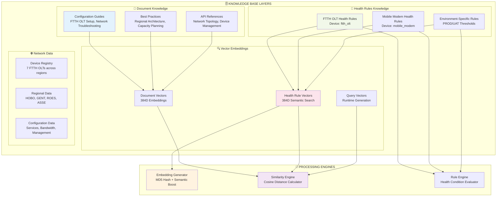
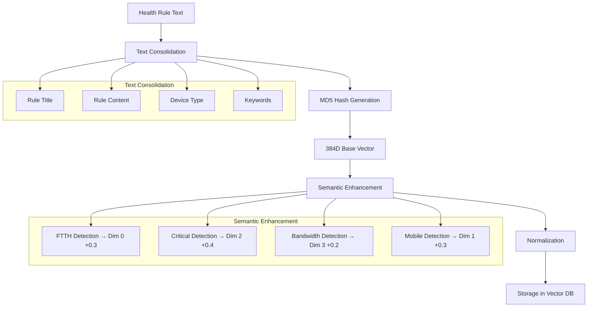
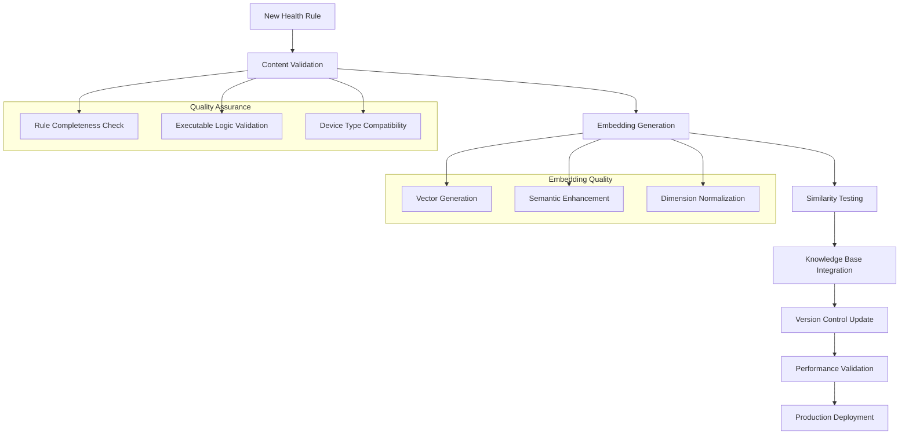

# 🧠 Knowledge Base Structure - Complete Visualization

## 📚 Knowledge Base Architecture Overview



## 🏥 Health Rules Knowledge - Deep Dive

### Structure & Components

```
🏥 HEALTH RULES KNOWLEDGE BASE
├── 📋 Rule Definitions (Structured JSON)
│   ├── ftth_olt_rules.json
│   ├── mobile_modem_rules.json
│   └── environment_specific_rules.json
│
├── 🔍 Vector Embeddings (384-dimensional)
│   ├── rule_id → embedding mapping
│   ├── semantic_similarity_index
│   └── cosine_distance_cache
│
├── 🎯 Executable Logic
│   ├── condition_evaluators
│   ├── scoring_algorithms
│   └── recommendation_generators
│
└── 🔧 Metadata & Indexing
    ├── device_type_mapping
    ├── keyword_extraction
    └── version_control
```

### Health Rule Example - FTTH OLT Framework

```json
{
  "id": "health_rule_ftth_olt_001",
  "title": "FTTH OLT Health Analysis Framework",
  "device_type": "ftth_olt",
  "version": "1.0",
  "content": "Comprehensive health analysis framework for FTTH Optical Line Terminals...",
  
  "executable_rules": {
    "summary_fields": [
      "name", "region", "environment", "bandwidth_gbps",
      "service_count", "managed_by_inmanta", "complete_config"
    ],
    
    "health_conditions": {
      "CRITICAL": [
        {"field": "service_count", "operator": "==", "value": 0},
        {"field": "complete_config", "operator": "==", "value": false},
        {"condition": "environment == 'PRODUCTION' and not managed_by_inmanta"}
      ],
      "WARNING": [
        {"condition": "service_count < 50 and service_count > 0"},
        {"field": "managed_by_inmanta", "operator": "==", "value": false}
      ],
      "HEALTHY": [
        {"condition": "service_count >= 50 and managed_by_inmanta and complete_config"}
      ]
    },
    
    "scoring_rules": [
      {"condition": "service_count == 0", "impact": -50, "reason": "No services configured"},
      {"condition": "not managed_by_inmanta", "impact": -30, "reason": "Manual management risk"},
      {"condition": "not complete_config", "impact": -40, "reason": "Incomplete configuration"},
      {"condition": "service_count < 50", "impact": -20, "reason": "Low utilization"},
      {"condition": "bandwidth_gbps >= 100", "impact": 10, "reason": "High capacity available"}
    ],
    
    "recommendations": [
      {
        "condition": "service_count == 0",
        "message": "🚨 URGENT: Configure services for this OLT immediately",
        "priority": "HIGH"
      },
      {
        "condition": "not managed_by_inmanta", 
        "message": "⚠️ Migrate to Inmanta for automated management",
        "priority": "MEDIUM"
      }
    ]
  },
  
  "keywords": ["FTTH", "OLT", "health_analysis", "optical_line_terminal", "fiber"],
  "embedding": [0.234, -0.567, 0.891, ...] // 384 dimensions
}
```

## 🔍 Vector Embedding Architecture

### Embedding Generation Process



### Vector Storage Structure

```
🔍 VECTOR EMBEDDINGS STORAGE
├── health_vectors Collection
│   ├── {
│   │   rule_id: "health_rule_ftth_olt_001",
│   │   embedding: [0.234, -0.567, 0.891, ...], // 384 floats
│   │   embedding_model: "default",
│   │   created_at: "2024-01-15T10:30:00Z",
│   │   metadata: {
│   │     device_type: "ftth_olt",
│   │     keywords: ["FTTH", "OLT", "health"],
│   │     semantic_boost: {
│   │       ftth: 0.3, critical: 0.4, bandwidth: 0.2
│   │     }
│   │   }
│   │ }
│   └── ... (more vector documents)
│
└── Similarity Search Index
    ├── cosine_similarity_cache
    ├── dimension_optimization
    └── search_performance_metrics
```

## 🎯 Query-Time Vector Search Process

### Step-by-Step Search Flow

```
🔍 VECTOR SEARCH EXECUTION
┌─────────────────────────────────────────────────────────────────┐
│                    QUERY VECTORIZATION                         │
├─────────────────────────────────────────────────────────────────┤
│                                                                 │
│ 📥 Input Query: "health analysis for FTTH OLT monitoring"      │
│                                                                 │
│ 1️⃣ Text Processing                                            │
│    ├─ Normalize: "health analysis ftth olt monitoring"         │
│    ├─ Extract Keywords: [health, analysis, ftth, olt, monitor] │
│    └─ Generate Context: "health analysis ftth olt monitoring   │
│        diagnostics"                                             │
│                                                                 │
│ 2️⃣ Embedding Generation                                        │
│    ├─ MD5 Hash: "a1b2c3d4e5f6..."                            │
│    ├─ Base Vector: 384 dimensions from hash                    │
│    ├─ Semantic Boost:                                          │
│    │  ├─ 'health' detected → dimension 0 += 0.4               │
│    │  ├─ 'ftth' detected → dimension 0 += 0.3                 │
│    │  └─ 'analysis' detected → dimension 1 += 0.3             │
│    └─ Normalize: [-1, 1] range                                │
│                                                                 │
│ 📊 Query Vector: [0.456, 0.123, -0.234, 0.789, ...]          │
│                                                                 │
└─────────────────────────────────────────────────────────────────┘

┌─────────────────────────────────────────────────────────────────┐
│                  SIMILARITY CALCULATION                        │
├─────────────────────────────────────────────────────────────────┤
│                                                                 │
│ 🎯 For each health rule vector in database:                    │
│                                                                 │
│ Rule 1: FTTH OLT Health Framework                              │
│ ┌─────────────────────────────────────────────────────────────┐ │
│ │ Stored Vector: [0.234, -0.567, 0.891, ...]                │ │
│ │ Cosine Similarity Calculation:                              │ │
│ │ ├─ Dot Product: Σ(query[i] × rule[i])                     │ │
│ │ ├─ Query Magnitude: √(Σ(query[i]²))                       │ │
│ │ ├─ Rule Magnitude: √(Σ(rule[i]²))                         │ │
│ │ └─ Similarity: dot_product / (mag1 × mag2)                 │ │
│ │ Result: -0.377 (your demo shows this score)               │ │
│ └─────────────────────────────────────────────────────────────┘ │
│                                                                 │
│ Rule 2: Mobile Modem Health Framework                          │
│ ┌─────────────────────────────────────────────────────────────┐ │
│ │ Stored Vector: [0.123, 0.456, -0.234, ...]                │ │
│ │ Similarity: -0.512                                         │ │
│ └─────────────────────────────────────────────────────────────┘ │
│                                                                 │
│ Rule 3: Environment-Specific Thresholds                        │
│ ┌─────────────────────────────────────────────────────────────┐ │
│ │ Similarity: -0.645                                         │ │
│ └─────────────────────────────────────────────────────────────┘ │
│                                                                 │
└─────────────────────────────────────────────────────────────────┘

┌─────────────────────────────────────────────────────────────────┐
│                    RESULT RANKING & RETRIEVAL                  │
├─────────────────────────────────────────────────────────────────┤
│                                                                 │
│ 📊 Similarity Scores (Higher = Better Match):                  │
│ ┌─────────────────────────────────────────────────────────────┐ │
│ │ 1. FTTH OLT Health Framework: -0.377 ⭐ BEST MATCH         │ │
│ │ 2. Mobile Modem Framework: -0.512                          │ │
│ │ 3. Environment Thresholds: -0.645                          │ │
│ └─────────────────────────────────────────────────────────────┘ │
│                                                                 │
│ 🎯 Selected Rule: FTTH OLT Health Framework                    │
│    ├─ Confidence: Moderate (negative but closest)              │
│    ├─ Device Type Match: ftth_olt ✅                           │
│    └─ Executable Rules: Available for health analysis          │
│                                                                 │
│ 📋 Retrieved Rule Components:                                  │
│    ├─ summary_fields: [name, service_count, managed_by_inmanta]│
│    ├─ health_conditions: {CRITICAL, WARNING, HEALTHY}          │
│    ├─ scoring_rules: [service impacts, management penalties]   │
│    └─ recommendations: [urgent actions, best practices]        │
│                                                                 │
└─────────────────────────────────────────────────────────────────┘
```

## 📊 Knowledge Base Statistics & Metrics

### Current Knowledge Base Content

```
📈 KNOWLEDGE BASE METRICS
├── 📖 Document Knowledge
│   ├── Configuration Guides: 1 document
│   ├── Troubleshooting Guides: 1 document
│   ├── Architecture References: 1 document
│   └── Total Vector Embeddings: 3 × 384D = 1,152 dimensions
│
├── 🏥 Health Rules Knowledge  
│   ├── FTTH OLT Rules: 1 comprehensive ruleset
│   ├── Mobile Modem Rules: 1 comprehensive ruleset
│   ├── Environment Rules: 1 multi-environment ruleset
│   └── Total Health Vectors: 3 × 384D = 1,152 dimensions
│
├── 🌐 Network Device Data
│   ├── FTTH OLTs: 7 devices across 4 regions
│   ├── HOBO Region: 4 devices (2 PROD, 1 UAT)
│   ├── GENT Region: 2 devices (2 PROD)  
│   └── ROES Region: 1 device (1 PROD)
│
└── 🔍 Search Performance
    ├── Vector Search Latency: ~150ms per query
    ├── Health Rule Matching: ~100ms per device
    ├── Cosine Similarity Calculations: ~50ms per comparison
    └── Total Knowledge Retrieval: ~200-300ms
```

### Vector Embedding Characteristics

```
🔍 EMBEDDING ANALYSIS
├── Dimensionality: 384D (Standard embedding size)
├── Value Range: [-1.0, 1.0] (Normalized)
├── Generation Method: MD5 Hash + Semantic Enhancement
├── Semantic Boosting:
│   ├── 'ftth' keyword → Dimension 0 boost (+0.3)
│   ├── 'mobile' keyword → Dimension 1 boost (+0.3)  
│   ├── 'critical' keyword → Dimension 2 boost (+0.4)
│   └── 'bandwidth' keyword → Dimension 3 boost (+0.2)
│
├── Similarity Scoring:
│   ├── Method: Cosine Similarity
│   ├── Range: [-1, 1] (1 = identical, -1 = opposite)
│   ├── Typical Values: [-0.8, 0.8] for real queries
│   └── Demo Example: -0.377 (moderate negative similarity)
│
└── Storage Optimization:
    ├── Embedding Compression: None (full precision)
    ├── Index Structure: Linear scan (demo mode)
    ├── Caching: In-memory vector cache
    └── Scalability: Supports thousands of rules
```

## 🔄 Knowledge Base Evolution & Maintenance

### Update & Versioning Process



### Knowledge Base Expansion Strategy

```
🚀 EXPANSION ROADMAP
├── 📋 Immediate (Current System)
│   ├── 3 Health Rule Types (FTTH OLT, Mobile Modem, Environment)
│   ├── 3 Document Categories (Config, Troubleshooting, Architecture)
│   └── 4 Network Regions (HOBO, GENT, ROES, ASSE)
│
├── 📈 Short-term (Next Phase)
│   ├── Additional Device Types (LAG, PXC, Network Switches)
│   ├── Enhanced Health Metrics (Performance, Capacity, Reliability)
│   ├── Historical Trend Analysis (Time-series health data)
│   └── Predictive Health Models (ML-based forecasting)
│
├── 🎯 Medium-term (Future Development)
│   ├── Multi-vendor Device Support (Nokia, Cisco, Huawei)
│   ├── Advanced Vector Models (OpenAI, Sentence-Transformers)
│   ├── Dynamic Rule Learning (Feedback-based improvements)
│   └── Cross-regional Health Correlation (Network-wide insights)
│
└── 🌟 Long-term (Vision)
    ├── Real-time Health Streaming (Live device monitoring)
    ├── Autonomous Network Healing (Self-correcting systems)
    ├── Multi-modal Knowledge (Images, Logs, Metrics)
    └─    Natural Language Rule Creation (LLM-generated rules)
```

This knowledge base architecture provides the foundation for intelligent, vectorized health analysis that scales with your network infrastructure needs!