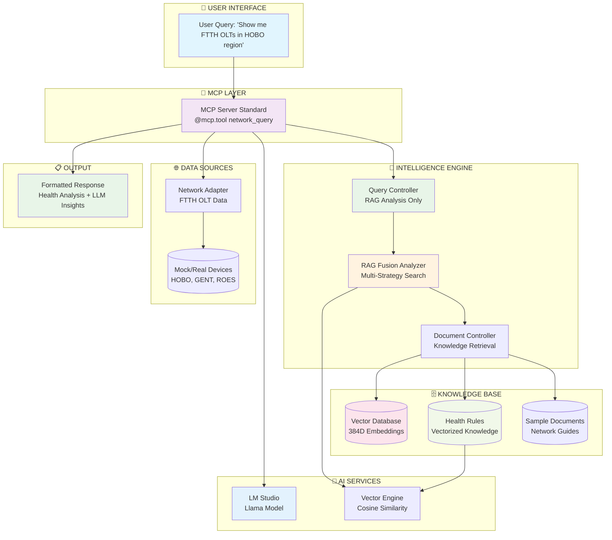

# 🔄 Network RAG System - Complete Flow Visualization

## 📊 High-Level System Architecture



## 🎯 Detailed Execution Flow

### Phase 1: Query Reception & Analysis
```
┌─────────────────────────────────────────────────────────────────┐
│                    🎯 PHASE 1: QUERY INTELLIGENCE               │
├─────────────────────────────────────────────────────────────────┤
│                                                                 │
│  📥 INPUT: "Show me FTTH OLTs in HOBO region"                  │
│                                                                 │
│  1️⃣ MCP Server Standard (@mcp.tool network_query)              │
│     ├─ Validates query format                                  │
│     ├─ Sets include_recommendations=True                       │
│     └─ Routes to Query Controller                              │
│                                                                 │
│  2️⃣ Query Controller (execute_intelligent_network_query)       │
│     ├─ Creates RAG Fusion Analyzer                             │
│     ├─ Calls: analyze_query_for_tool_selection(query)          │
│     └─ Returns: {'query': query, 'guidance': guidance}         │
│                                                                 │
│  3️⃣ RAG Fusion Analyzer (analyze_query_for_tool_selection)     │
│     ├─ Multi-Strategy Document Search (4 strategies)           │
│     ├─ Pattern Analysis & Scoring                              │
│     ├─ Tool Recommendation Logic                               │
│     └─ Confidence Calibration                                  │
│                                                                 │
│  📤 OUTPUT: guidance = {                                        │
│       analysis_type: "device_listing",                         │
│       confidence: "LOW",                                        │
│       reasoning: "Query requests device inventory...",          │
│       recommended_tool: "list_network_devices"                 │
│     }                                                           │
└─────────────────────────────────────────────────────────────────┘
```

### Phase 2: Multi-Strategy Knowledge Search
```
┌─────────────────────────────────────────────────────────────────┐
│               🔍 PHASE 2: KNOWLEDGE RETRIEVAL                   │
├─────────────────────────────────────────────────────────────────┤
│                                                                 │
│  🧠 RAG Fusion: 4 Parallel Knowledge Searches                  │
│                                                                 │
│  Strategy 1: Tool Selection Focus                              │
│  ┌─────────────────────────────────────────────────────────────┐ │
│  │ Search: "tool selection for: Show me FTTH OLTs..."         │ │
│  │ Targets: Tool recommendation documents                      │ │
│  │ Results: "list_network_devices", "device inventory"        │ │
│  └─────────────────────────────────────────────────────────────┘ │
│                                                                 │
│  Strategy 2: Procedural Approach                               │
│  ┌─────────────────────────────────────────────────────────────┐ │
│  │ Search: "how to handle query: Show me FTTH OLTs..."        │ │
│  │ Targets: Step-by-step procedures                           │ │
│  │ Results: "device listing procedures", "filtering steps"    │ │
│  └─────────────────────────────────────────────────────────────┘ │
│                                                                 │
│  Strategy 3: Protocol-Specific                                 │
│  ┌─────────────────────────────────────────────────────────────┐ │
│  │ Search: "MCP tool for Show me FTTH OLTs..."                │ │
│  │ Targets: MCP protocol guidance                              │ │
│  │ Results: "MCP network_query tool", "tool routing"          │ │
│  └─────────────────────────────────────────────────────────────┘ │
│                                                                 │
│  Strategy 4: Domain-Specific                                   │
│  ┌─────────────────────────────────────────────────────────────┐ │
│  │ Search: "network analysis approach for: FTTH OLTs HOBO"    │ │
│  │ Targets: Network engineering practices                      │ │
│  │ Results: "FTTH deployment", "regional assessment"          │ │
│  └─────────────────────────────────────────────────────────────┘ │
│                                                                 │
│  🔄 Fusion Process: Combines all 4 result sets                 │
│  📊 Analysis: Pattern scoring → device_listing (7 points)      │
│                                                                 │
└─────────────────────────────────────────────────────────────────┘
```

### Phase 3: Strategy Execution & Data Retrieval
```
┌─────────────────────────────────────────────────────────────────┐
│              🌐 PHASE 3: DATA RETRIEVAL & PROCESSING            │
├─────────────────────────────────────────────────────────────────┤
│                                                                 │
│  🔄 Control returns to MCP Server Standard                     │
│  📋 Executes: _execute_device_listing_strategy()               │
│                                                                 │
│  1️⃣ Region Extraction                                          │
│     ├─ _extract_region_from_query(query)                       │
│     ├─ Regex: ['hobo', 'gent', 'roes', 'asse']                │
│     ├─ Match: 'hobo' → 'HOBO'                                  │
│     └─ Filter: {"region": "HOBO"}                              │
│                                                                 │
│  2️⃣ Network Data Retrieval                                     │
│     ├─ query_controller.network_port.fetch_ftth_olts(filters)  │
│     ├─ MockNetworkAdapter.fetch_ftth_olts({"region": "HOBO"}) │
│     └─ Returns: 4 HOBO devices                                 │
│                                                                 │
│  3️⃣ Device Health Summary Generation                           │
│     ┌───────────────────────────────────────────────────────┐ │
│     │ For each device:                                      │ │
│     │ ├─ device.get_health_summary()                        │ │
│     │ ├─ Extracts: name, region, environment, bandwidth     │ │
│     │ ├─         service_count, managed_by_inmanta         │ │
│     │ └─         complete_config, connection_type          │ │
│     └───────────────────────────────────────────────────────┘ │
│                                                                 │
│  📊 Device Data Collected:                                     │
│     • OLT17PROP01: 200 services, managed, complete config     │
│     • OLT18PROP02: 150 services, NOT managed, incomplete      │
│     • OLT19PROP03: 0 services, managed, incomplete            │
│     • OLT20PROP01: 50 services, managed, complete config      │
│                                                                 │
└─────────────────────────────────────────────────────────────────┘
```

### Phase 4: Vectorized Health Analysis
```
┌─────────────────────────────────────────────────────────────────┐
│            🔍 PHASE 4: VECTORIZED HEALTH ANALYSIS               │
├─────────────────────────────────────────────────────────────────┤
│                                                                 │
│  🏥 Health Analysis per Device (KnowledgeDrivenHealthAnalyzer)  │
│                                                                 │
│  For OLT17PROP01:                                              │
│  ┌─────────────────────────────────────────────────────────────┐ │
│  │ 1. Vector Search for Health Rules                          │ │
│  │    ├─ Query: "health analysis ftth olt monitoring"         │ │
│  │    ├─ Generate embedding: [0.123, -0.456, 0.789, ...]     │ │
│  │    ├─ Cosine similarity search against health_vectors      │ │
│  │    └─ Best match: FTTH OLT Health Framework (-0.377)       │ │
│  │                                                             │ │
│  │ 2. Extract Device Data                                      │ │
│  │    ├─ name: "OLT17PROP01"                                  │ │
│  │    ├─ service_count: 200                                   │ │
│  │    ├─ managed_by_inmanta: True                             │ │
│  │    └─ complete_config: True                                │ │
│  │                                                             │ │
│  │ 3. Apply Scoring Rules                                     │ │
│  │    ├─ Base score: 100                                      │ │
│  │    ├─ service_count == 0? NO (200 services)               │ │
│  │    ├─ not managed_by_inmanta? NO (True)                   │ │
│  │    ├─ not complete_config? NO (True)                      │ │
│  │    └─ Final score: 100/100                                │ │
│  │                                                             │ │
│  │ 4. Determine Health Status                                 │ │
│  │    └─ Score 100 → HEALTHY                                 │ │
│  └─────────────────────────────────────────────────────────────┘ │
│                                                                 │
│  🔴 Critical Device Analysis (OLT19PROP03):                    │
│  ┌─────────────────────────────────────────────────────────────┐ │
│  │ 1. Same vector search → Same health rules                  │ │
│  │ 2. Extract: service_count=0, managed=True, complete=False  │ │
│  │ 3. Scoring:                                                 │ │
│  │    ├─ Base: 100                                            │ │
│  │    ├─ service_count == 0? YES → -50 points                │ │
│  │    ├─ service_count < 50? YES → -20 points                │ │
│  │    └─ Final: 100-50-20 = 30 → Score 30/100               │ │
│  │ 4. Status: Score 30 → CRITICAL                            │ │
│  │ 5. Recommendations: "🚨 URGENT: Configure services..."     │ │
│  └─────────────────────────────────────────────────────────────┘ │
│                                                                 │
└─────────────────────────────────────────────────────────────────┘
```

### Phase 5: LLM Intelligence Integration
```
┌─────────────────────────────────────────────────────────────────┐
│              🤖 PHASE 5: LLM INTELLIGENCE GENERATION            │
├─────────────────────────────────────────────────────────────────┤
│                                                                 │
│  🧠 LM Studio Integration (_generate_llm_analysis)             │
│                                                                 │
│  1️⃣ Context Assembly                                           │
│     ┌───────────────────────────────────────────────────────┐ │
│     │ System Prompt:                                        │ │
│     │ "You are a network infrastructure analyst..."         │ │
│     │                                                       │ │
│     │ User Context:                                         │ │
│     │ ├─ Original Query: "Show me FTTH OLTs in HOBO..."    │ │
│     │ ├─ Analysis Type: device_listing                     │ │
│     │ ├─ Device Data: [4 HOBO devices with full details]   │ │
│     │ ├─ Health Summaries: [Scores, status, recommendations] │ │
│     │ └─ RAG Guidance: [Pattern analysis, confidence]      │ │
│     └───────────────────────────────────────────────────────┘ │
│                                                                 │
│  2️⃣ LM Studio HTTP Request                                     │
│     ├─ POST: http://127.0.0.1:1234/v1/chat/completions        │
│     ├─ Model: llama-3.2-8x3b-moe-dark-champion-instruct...    │
│     ├─ Max Tokens: 2048, Temperature: 0.7                     │
│     └─ Timeout: 120 seconds                                    │
│                                                                 │
│  3️⃣ LLM Response Processing                                    │
│     ├─ Status: 200 OK                                          │
│     ├─ Content: 1973 characters                                │
│     ├─ Analysis: Detailed network engineering insights        │
│     └─ Insights: Device assessment, recommendations, findings  │
│                                                                 │
│  📊 LLM Generated Analysis:                                    │
│     • Device inventory confirmation (4 OLTs found)            │
│     • Configuration issue identification                       │
│     • Network engineering recommendations                      │
│     • Regional analysis and optimization suggestions          │
│                                                                 │
└─────────────────────────────────────────────────────────────────┘
```

### Phase 6: Response Assembly & Delivery
```
┌─────────────────────────────────────────────────────────────────┐
│              📋 PHASE 6: RESPONSE FORMATTING & DELIVERY         │
├─────────────────────────────────────────────────────────────────┤
│                                                                 │
│  ✨ Response Assembly (in MCP Server Standard)                 │
│                                                                 │
│  📝 Response Structure:                                        │
│  ┌─────────────────────────────────────────────────────────────┐ │
│  │ # Network RAG Analysis                                      │ │
│  │ **Query:** Show me FTTH OLTs in HOBO region                │ │
│  │                                                             │ │
│  │ **Analysis Type:** device_listing                          │ │
│  │ **Confidence:** LOW                                         │ │
│  │ **Reasoning:** Query requests device inventory...          │ │
│  │                                                             │ │
│  │ ## Device Listing Result                                   │ │
│  │ Found **4** FTTH OLT devices in **HOBO** region.          │ │
│  │                                                             │ │
│  │ ### Device Summary with Knowledge-Based Health Analysis    │ │
│  │ 1. **OLT17PROP01** (HOBO/PRODUCTION) - ✅ HEALTHY [100/100] │ │
│  │ 2. **OLT18PROP02** (HOBO/PRODUCTION) - 🔴 CRITICAL [30/100] │ │
│  │    └─ ⚠️ Migrate to Inmanta for automated management      │ │
│  │ 3. **OLT19PROP03** (HOBO/PRODUCTION) - 🔴 CRITICAL [0/100]  │ │
│  │    └─ [HIGH PRIORITY] 🚨 URGENT: Configure services...     │ │
│  │ 4. **OLT20PROP01** (HOBO/UAT) - ✅ HEALTHY [100/100]       │ │
│  │                                                             │ │
│  │ ## LLM Analysis                                             │ │
│  │ [1973 characters of intelligent network analysis]          │ │
│  │ • Device inventory confirmation                             │ │
│  │ • Configuration recommendations                             │ │
│  │ • Network optimization insights                             │ │
│  └─────────────────────────────────────────────────────────────┘ │
│                                                                 │
│  🎯 Final Output: Complete formatted markdown response         │
│  📤 Delivery: Returned to MCP client/demo interface            │
│                                                                 │
└─────────────────────────────────────────────────────────────────┘
```

## 🔄 Data Flow Summary

```
User Query → MCP Server → Query Controller → RAG Fusion Analyzer
                ↓
    Multi-Strategy Knowledge Search (4 parallel searches)
                ↓
      Pattern Analysis & Tool Selection (device_listing)
                ↓
        Region Extraction & Network Data Retrieval
                ↓
      Vectorized Health Analysis (per device, 384D embeddings)
                ↓
          LLM Intelligence Generation (LM Studio)
                ↓
        Response Assembly & Formatting (markdown)
                ↓
              Final Output Delivery
```

## ⚡ Performance Metrics

| Phase | Component | Typical Duration | Key Operations |
|-------|-----------|------------------|----------------|
| 0 | System Initialization | ~2s | Health rules loading, LM Studio connection |
| 1 | Query Analysis | ~200ms | Pattern matching, tool selection |
| 2 | Knowledge Search | ~300ms | Vector similarity search |
| 3 | Data Retrieval | ~100ms | Network device fetching |
| 4 | Health Analysis | ~150ms per device | Vector search, rule evaluation |
| 5 | LLM Generation | ~4-6s | HTTP request to LM Studio (256 tokens) |
| 6 | Response Assembly | ~50ms | Markdown formatting |
| **Total Demo** | **~12-15 seconds** | **Complete demonstration** | **Full system showcase** |