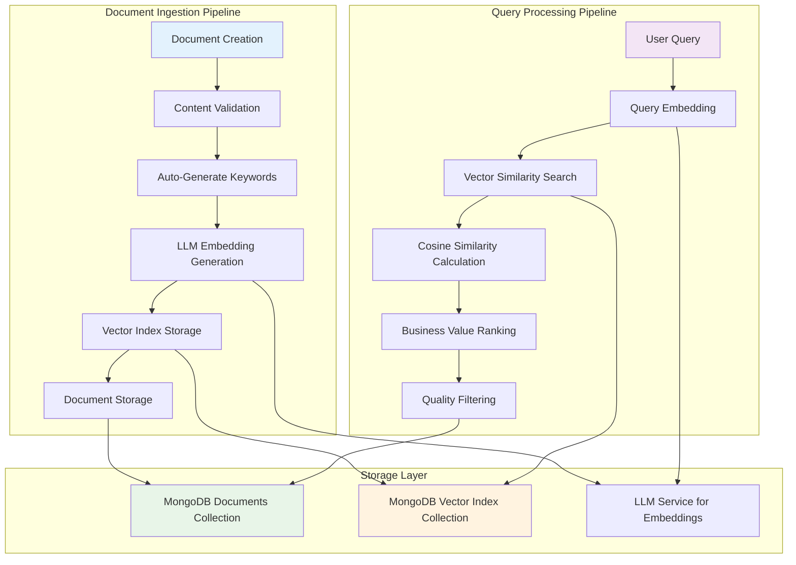
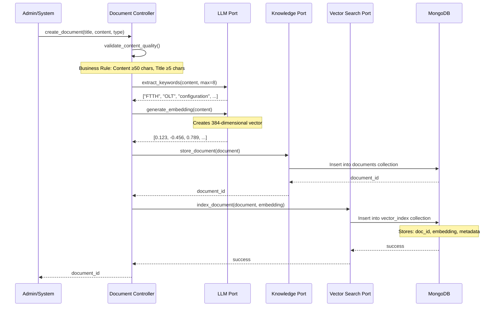
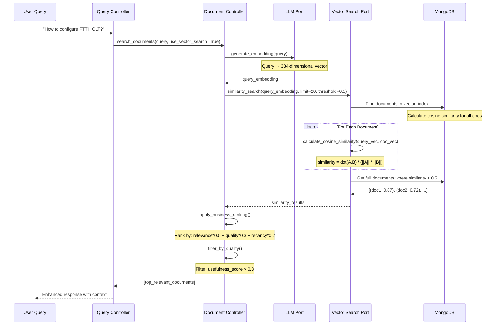
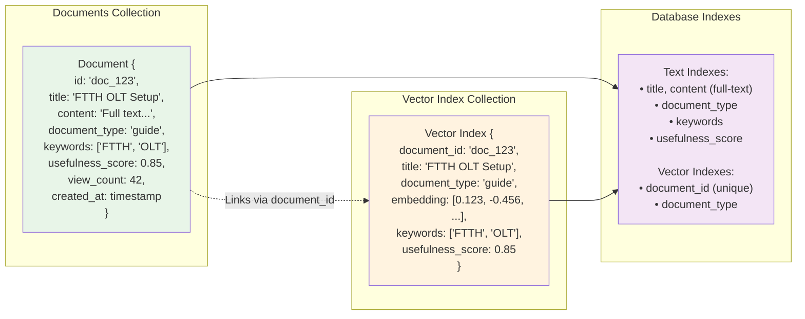
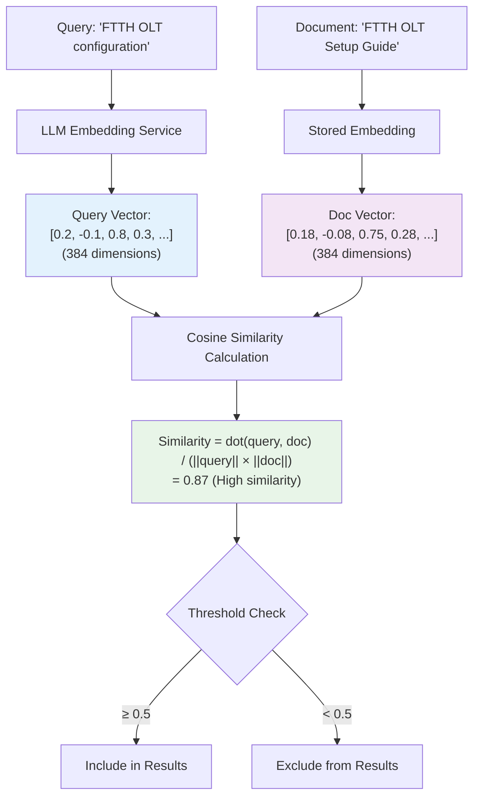
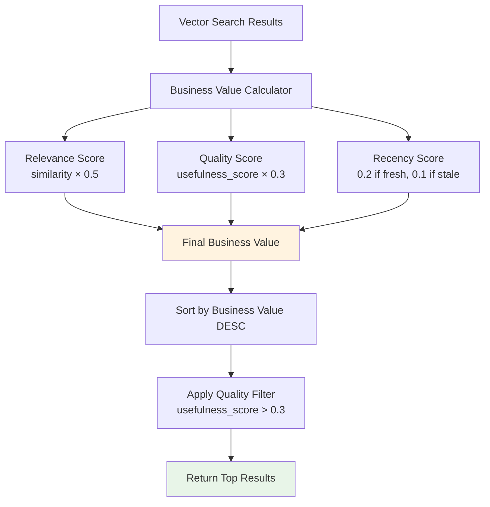
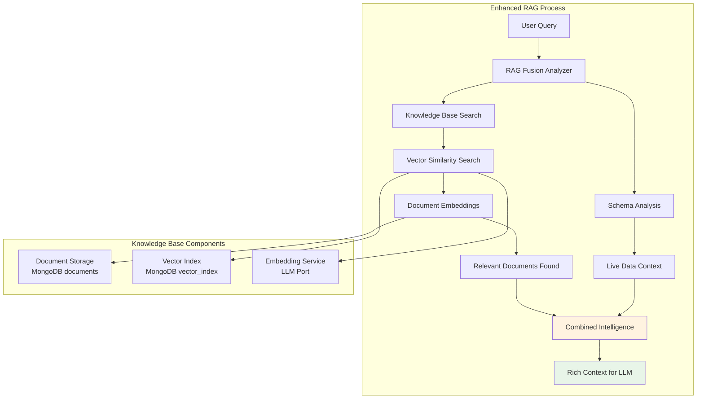

# Knowledge Base Embedding & Retrieval Flow

## 🔍 Complete Knowledge Base Architecture



## 📊 Document Embedding Process



## 🔍 Knowledge Retrieval Process



## 🗄️ MongoDB Storage Structure



## 🧮 Vector Similarity Calculation



## 📈 Business Value Ranking Algorithm



## 🔄 RAG Fusion Integration



## 🎯 Key Technical Details

### **Embedding Specifications:**
- **Dimension:** 384 (default, configurable)
- **Model:** Via LLM Port (configurable service)
- **Storage:** MongoDB `vector_index` collection
- **Similarity:** Cosine similarity calculation

### **Search Pipeline:**
1. **Query Embedding:** Convert text to 384-dim vector
2. **Similarity Search:** Calculate cosine similarity with all docs
3. **Filtering:** Apply quality threshold (usefulness_score > 0.3)
4. **Ranking:** Business value = relevance×0.5 + quality×0.3 + recency×0.2
5. **Return:** Top ranked documents

### **Business Rules:**
- **Content Quality:** Minimum 50 characters content, 5 characters title
- **Auto-Keywords:** LLM extracts up to 8 keywords per document
- **Similarity Threshold:** 0.5 for search inclusion
- **Quality Filter:** usefulness_score > 0.3 for results
- **Staleness:** Documents >90 days considered stale

### **Performance Features:**
- **MongoDB Indexes:** Full-text, document_type, keywords, scores
- **Batch Operations:** Bulk similarity searches supported
- **Caching:** Vector embeddings stored for reuse
- **Async:** Full async/await throughout pipeline

## 🔍 Example Search Flow

```
Query: "How many FTTH OLTs in HOBO region?"
    ↓
1. Generate embedding: [0.2, -0.1, 0.8, ...]
    ↓
2. MongoDB vector_index search
    ↓
3. Calculate similarities:
   - "FTTH OLT Management Guide" → 0.87
   - "HOBO Region Network Setup" → 0.82
   - "OLT Configuration Best Practices" → 0.78
    ↓
4. Business ranking:
   - Guide: 0.87×0.5 + 0.9×0.3 + 0.2 = 0.905
   - Setup: 0.82×0.5 + 0.85×0.3 + 0.1 = 0.765
    ↓
5. Return top 3 documents to RAG system
    ↓
6. Combine with live data context
    ↓
7. Generate intelligent response
```

This shows how your knowledge base uses semantic vector search to find the most relevant documentation and combine it with live network data for truly intelligent responses.