# Schema-Aware RAG System Flow Visualization

## 🔄 Complete System Flow Diagram

```mermaid
graph TD
    A[User Query: "How many FTTH OLTs in HOBO?"] --> B[MCP Server]
    B --> C[Query Controller]
    
    C --> D[Enhanced RAG Fusion Analyzer]
    D --> E[Traditional RAG Search]
    D --> F[Schema-Aware Analysis]
    
    E --> G[Knowledge Base Documents]
    G --> H[Document Embeddings]
    H --> I[Similar Documents Found]
    
    F --> J[Schema Registry]
    F --> K[Data Quality Service]
    F --> L[Schema-Aware Context Builder]
    
    J --> M[Identify Relevant Schemas<br/>ftth_olt, team]
    K --> N[Get Live Data Samples<br/>127 OLT records]
    K --> O[Assess Data Quality<br/>87% health score]
    L --> P[Build Rich Context]
    
    I --> Q[RAG Guidance]
    P --> R[Schema Context]
    
    Q --> S[Tool Selection Logic]
    R --> S
    
    S --> T{Data Quality Check}
    T -->|High Quality 87%| U[Execute: list_network_devices]
    T -->|Low Quality <50%| V[Execute: data_quality_report]
    
    U --> W[Network Port]
    W --> X[Fetch FTTH OLTs]
    X --> Y[Filter by HOBO region]
    Y --> Z[23 devices found]
    
    Z --> AA[Response Formatter]
    R --> AA
    Q --> AA
    
    AA --> BB[Rich LLM Context:<br/>• Query + Intent<br/>• Structured Data + Schema<br/>• Quality Metrics<br/>• Business Context]
    
    BB --> CC[LLM Processing]
    CC --> DD[Intelligent Response:<br/>"Based on current data...<br/>23 FTTH OLTs in HOBO<br/>21 Production, 2 UAT<br/>Data Quality: 🟢 87%"]
    
    DD --> EE[User Response]
    
    style A fill:#e1f5fe
    style DD fill:#e8f5e8
    style BB fill:#fff3e0
    style R fill:#f3e5f5
    style Q fill:#e0f2f1
```

## 🏗️ Component Architecture


## 📊 Data Flow Through System


## 🔍 Schema Context Building Process

```mermaid
graph LR
    A[Query: "FTTH OLTs in HOBO"] --> B[Schema Registry]
    B --> C[Identify: ftth_olt schema]
    C --> D[Get Schema Definition]
    
    A --> E[Data Quality Service]
    E --> F[Sample Live Data]
    F --> G[Assess Quality Metrics]
    G --> H[Completeness: 95%<br/>Freshness: 90%<br/>Overall: 87%]
    
    D --> I[Schema-Aware Context Builder]
    H --> I
    
    I --> J[Rich Context Object]
    J --> K[Available Data: 127 records<br/>Quality: 🟢 Good 87%<br/>Schema: ftth_olt fields<br/>Recommendations: Proceed]
    
    style J fill:#fff3e0
    style K fill:#e8f5e8
```

## 🧠 Traditional vs Schema-Aware Comparison


## 🎯 Key Innovation Visualization

```mermaid
graph TD
    A[User Query] --> B{Enhanced RAG Analysis}
    
    B --> C[Traditional Search:<br/>Knowledge Base Documents]
    B --> D[NEW: Schema Analysis:<br/>Data Structure Understanding]
    B --> E[NEW: Data Quality:<br/>Live Data Assessment]
    
    C --> F[Tool Guidance]
    D --> G[Schema Context]
    E --> H[Quality Metrics]
    
    F --> I[Combined Intelligence]
    G --> I
    H --> I
    
    I --> J[LLM receives:<br/>🔍 What to do Tool guidance<br/>📊 What data looks like Schema<br/>✅ How reliable it is Quality<br/>🎯 Why it matters Business context]
    
    J --> K[Intelligent Response]
    
    style D fill:#ffebee
    style E fill:#e8f5e8
    style G fill:#fff3e0
    style H fill:#f3e5f5
    style J fill:#e3f2fd
```



## 📈 Data Quality Impact on Tool Selection

```mermaid
graph TD
    A[Query Analysis] --> B{Data Quality Check}
    
    B -->|Quality > 80%| C[✅ Execute Standard Tool<br/>High confidence response]
    B -->|Quality 50-80%| D[⚠️ Execute with Warning<br/>Mention data concerns]
    B -->|Quality < 50%| E[🔴 Recommend Data Refresh<br/>Switch to quality report tool]
    
    C --> F[User gets: Accurate analysis]
    D --> G[User gets: Analysis + quality warning]
    E --> H[User gets: Data health report instead]
    
    style C fill:#e8f5e8
    style D fill:#fff3e0
    style E fill:#ffebee
```



This visualization shows how your Schema-Aware RAG system transforms a simple query into intelligent, context-aware responses by combining traditional RAG with real-time data schema and quality awareness.